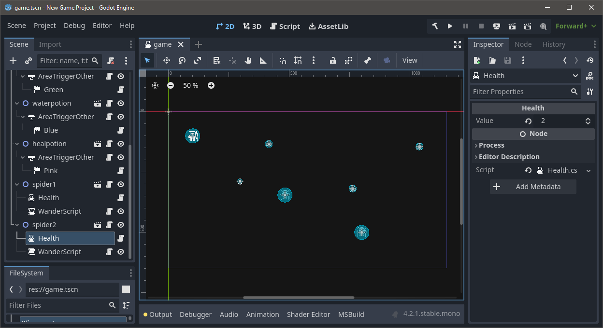

# GodotFlecs
A (slightly) opinionated ECS for Godot C#. Core prinicples are providing `Entity2D` and `WorldNode` nodes that automatically register children as components. On each physics frame, the ECS world executes all systems. There are additionally nodes for other logic patterns: `Script`, `StateMachine`, and `Trigger`.

Nodes and components are kept in sync between the Godot Scene Tree, and the Flecs World. This means that you can use the Godot Editor to create and edit your game, and then use Flecs to add logic to your game. Adding a child node to an `Entity2D` will automatically add a component to the entity. Removing a child node will remove the component. Starting from Flecs also works, i.e., adding an unparented `Node` as a component will add it to the Godot Scene Tree.



##s# C# Script Example
```cs
public partial class Game : WorldNode
{
	public override void _Ready()
	{
		base._Ready();

        // movement system matches on Sprite2D componets automatically discovered by Entity2D,
        // and Movement components added by input detection
		World.Routine<Movement, Sprite2D>()
            .Each((Entity entity, ref Movement movement, ref Sprite2D sprite) =>
            {
                sprite.Position += movement.Direction * 10;

                entity.Remove<Movement>();
            });
	}

	public override void _PhysicsProcess(double delta)
	{
		var direction = Godot.Input
            .GetVector("ui_left", "ui_right", "ui_up", "ui_down")
            .Normalized();

		if (!direction.IsZeroApprox())
		{
            // gets the Flecs `Entity` associated with the node named "Player"
			GetNode("Player")
                .GetEntity(World)
                .Set(new Movement { Direction = direction });
		}
	}
}

public partial class Movement : Node2D
{
    public Vector2 Direction { get; set; }
}
```

### Scene
```ini
[gd_scene load_steps=3 format=3 uid="uid://gameuid"]

[ext_resource type="Script" path="res://Game.cs" id="1"]
[ext_resource type="Script" path="res://Tools/Entity2D.cs" id="2"]
[ext_resource type="Texture2D" uid="uid://textureuid" path="res://icon.svg" id="3"]

[node name="Game" type="1"]
script = ExtResource("1")

[node name="Player" type="Node2D"]
script = ExtResource("2")

[node name="Sprite2D" type="Sprite2D" parent="Player"]
texture = ExtResource("3")
```

## Setup
First, you'll want to copy the contents of `Tools` into your Godot C# project.

```
dotnet nuget add source https://gitlab.com/api/v4/projects/51698729/packages/nuget/index.json -n Gitlab
dotnet restore
```

## Build and Run
```
dotnet build
godot
```

## Example
This project is a Godot project, so you can open it in Godot and run it. The example is a simple game where you control a player with mouse. The potions and fire entities will invoke `AreaTrigger` components, while the spiders will follow the `WanderScript` scripting.

## Super-Duper Pre-Alpha
This framework is in a very early stage. It's not ready for production use. I'm totally open to API changes and feedback.